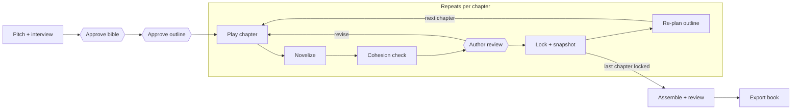
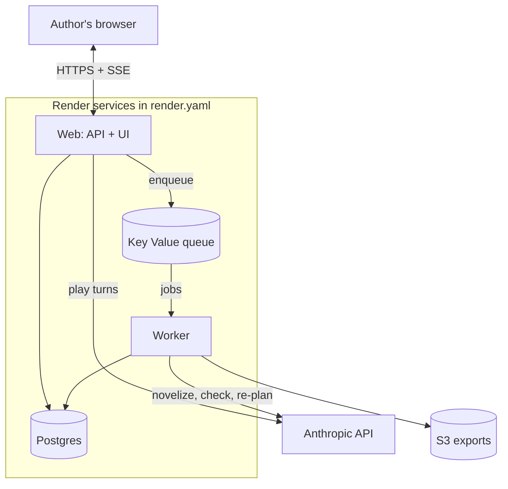

# Story Forge — Interactive Novel Engine: Build Spec

Sep 26, 2026 · Zach Parr

## Overview

Story Forge (working name) is a new web app, in its own repo on Render, that co-writes a novel with the author by playing it as an interactive story, one chapter at a time. The author pitches an idea, the AI interviews them to shape it, the author approves a story bible and outline, then they play through each chapter together. Each finished chapter becomes book prose, and the locked chapters assemble into a manuscript.

**Core loop:** pitch → interview → approve bible → approve outline → play chapter → novelize → review → lock → re-plan → next chapter → assemble book.

**Goals**

- A finished, coherent novel of 60k–100k words, with a novella (20k–30k) as the first target.
- The author stays in control: every stage passes an explicit approval gate, and nothing locks without the author.
- Cohesion is enforced by the system, not hoped for: a fixed spine, character cards, a continuity ledger, a promise registry, and a cohesion check before every lock.
- Play feels like the author's existing story engine: responsive, streamed, with in-character and author-note input.

**Non-goals for v1**

- Multi-user collaboration on one book.
- Publishing, marketplace or sharing features beyond file export.
- Illustrations or cover art.
- Fully autonomous book generation with no author in the loop (a later option; see Agents).

**Recommended stack** (swap to match the existing story engine if it differs): TypeScript throughout; React + Vite front end; Node API (Fastify); Postgres via Drizzle ORM; BullMQ job queue on Render Key Value; Anthropic SDK for all model calls; S3 for exports.

## Workflow and state machine

The project moves through three setup gates, then repeats a six-step loop per chapter until the last chapter locks.



Hexagon nodes are author approval gates. A failed cohesion check or an author "revise" sends the chapter back to play or re-novelization. Nothing locks without explicit author approval.

**Project status:** `intake` → `bible_review` → `outline_review` → `writing` → `assembling` → `complete`. Every forward transition is an author action, never automatic.

**Chapter status:** `planned` → `playing` → `drafting` → `review` → `locked`. Unlocking a chapter sets every later locked chapter to `needs_recheck`.

**Stage behavior**

1. **Intake.** The author pitches in free text. The interviewer asks 3–5 rounds of 3–5 questions (genre, tone, POV and tense, protagonist, antagonist, theme, ending, length). The author can answer, skip, or reply "you decide." Output: a draft story bible.
2. **Bible review.** Every field is editable inline and any section can be regenerated with notes. Approval is blocked until the spine fields are filled (see Cohesion system).
3. **Outline review.** A chapter list with purpose, required beats, arcs moved, and anchor beats marked. Chapters are editable and reorderable. Approval moves the project to `writing`.
4. **Play chapter.** The director opens the chapter's situation and play proceeds turn by turn. A beat tracker shows required beats hit. "End chapter" enables once required beats land; the author confirms.
5. **Novelize.** A background job turns the chapter chronicle and key dialogue into prose.
6. **Cohesion check.** A background job produces a report of issues by severity (blocker, warning, note).
7. **Author review.** Prose and cohesion report side by side. Actions: edit inline, regenerate with notes, return to play, or lock. Blockers must be resolved or explicitly waived.
8. **Lock + snapshot.** Commits ledger, knowledge map, registry, and card updates in one transaction, snapshots all project state, and enqueues re-plan.
9. **Re-plan.** Proposes changes to remaining chapters as a diff against the outline. The author accepts or rejects each change. Anchor beats never move without explicit author edit.
10. **Assemble + review.** A whole-book pass flags pacing, repetition, and theme drift. The author revises flagged chapters, then exports.

## Cohesion system

Cohesion rests on six structures that every agent reads and the cohesion critic checks before any chapter locks.

**1. Spine (fixed at bible approval).** Required fields: central dramatic question, theme statement, ending (how it resolves and what it costs), and 3–5 anchor beats (inciting incident, midpoint reversal, dark moment, climax, optional others) each assigned to a target chapter. The spine changes only through an explicit author edit, which triggers a full outline re-plan.

**2. Character arcs.** Every major character card holds an arc start state, end state, and checkpoints mapped to chapters. Each chapter plan lists which arcs it must move and how.

**3. Continuity ledger.** Append-only facts extracted at lock: events, locations, injuries, objects, relationships, timeline. Each fact records its source chapter and can be superseded (never deleted) by a later fact.

**4. Knowledge map.** Per character: what they know, since which chapter, and how they learned it. The director and NPC agents may only act on knowledge the character has. The critic flags any action based on unknown information.

**5. Promise registry.** Every setup (mystery, foreshadowing, planted object, open conflict, vow) gets an entry with a type, the chapter planted, a target payoff window, and status (`open`, `paid`, `dropped`). The director must pay an open promise within its window or ask the author to extend or drop it. Promises past their window are cohesion blockers.

**6. Style guide.** POV, tense, prose register, banned phrases list, and 2–3 sample paragraphs approved by the author. Used by every prose-producing agent.

**Drift handling.** During play, the director compares events against the chapter plan and outline. When play diverges from a required beat, contradicts the ledger, or creates an unplanned major thread, it raises a drift notice in the UI with two options: steer back (the director works the beat in) or adopt (the change is written into the outline, registry, or cards immediately). Drift is never silent.

**Cohesion critic (runs after novelization, before review).** Checks the draft against the spine, arcs, ledger, knowledge map, promise registry, character principles, and style guide. Output is a structured report:

| Field | Values |
| --- | --- |
| severity | blocker, warning, note |
| category | contradiction, knowledge, principle, promise, arc, theme, style, pacing |
| location | paragraph reference in the draft |
| evidence | the ledger fact, card field, or registry entry it conflicts with |
| suggested fix | one-line fix the author can apply or ignore |

Blockers prevent lock until fixed or waived with a reason, which is logged.

## Character system

Every named character gets a card, tiered so walk-ons never interrupt play and major characters are fully defined before they can drift.

| Tier | Fields | Author prompt |
| --- | --- | --- |
| Walk-on | name, role, location, one trait, first appearance | None; auto-created |
| Minor | walk-on fields + story role, want, relationship to protagonist, voice note | Draft card for approval |
| Major | minor fields + core principles (what they will never do), goal, fear or flaw, secret, arc start/end/checkpoints, key relationships, voice samples | Draft card for approval; required fields enforced |

**Detection.** After each play turn, a lightweight extraction step detects newly named characters and creates a `provisional` card with the tier the AI proposes.

**Draft, then approve.** The card drafter fills the card from the scene, the bible, and the ledger. The approval prompt appears at a natural pause (end of scene or chapter), never mid-turn. The author can approve, edit, change tier, merge with an existing card ("this is the same person"), or reject. Provisional cards are usable in play but unlocked.

**Gate.** A chapter cannot lock while any character appearing in it has an unapproved minor or major card.

**Promotion.** The director suggests promotion when a character appears in 3 or more chapters, affects a required beat, or gets attached to a promise. Promotion prompts only for the missing fields.

**Principles enforcement.** The NPC agent receives the character's principles, goal, and knowledge as hard constraints. The cohesion critic checks every significant action against them. When the story needs a character to break type, the director raises it as a deliberate turning point for the author to approve, and the card records the change.

**Versioning.** Cards are versioned. Each version records the chapter where it takes effect, so chapter N is always checked against the card as it stood in chapter N. Arc checkpoints being met produce a new version automatically, pending author approval.

## Agents and prompts

Ten agents, each a single prompt template with a typed input and a JSON-schema output, routed to a fast or strong model tier by config.

| Agent | Runs | Tier | Output |
| --- | --- | --- | --- |
| Interviewer | Intake, per round | Fast | Next question round, or a draft bible when complete |
| Outliner | After bible approval; on spine edit | Strong | Chapter list: purpose, required beats, arcs moved, anchors, promises planted/paid |
| Director | Every play turn (streamed) | Fast | Narration + NPC actions, beat-tracker updates, drift notices |
| NPC voice | Called by director for major characters in scene | Fast | Character's action and dialogue under card constraints |
| Extractor | After each play turn | Fast | Chronicle event, new characters, candidate ledger facts, new promises |
| Card drafter | New or promoted character | Fast | Filled character card at the proposed tier |
| Novelizer | Chapter end (job) | Strong | Chapter prose in book POV, tense, and style |
| Cohesion critic | After novelization (job) | Strong | Issue report per the Cohesion system table |
| Re-planner | After lock (job) | Strong | Outline diff for remaining chapters, with reasons |
| Book reviewer | Assembly (job) | Strong | Whole-book issues: pacing, repetition, theme drift, dropped threads |

**Prompt rules**

- Prompts live in `/prompts/<agent>.md` as versioned templates; every model call logs the prompt version.
- All non-prose outputs use structured JSON validated with Zod; invalid output retries once with the validation error, then fails the job.
- The director treats text in `[author: ...]` as out-of-character instructions that override the plan for that scene, and logs them to the chronicle so the novelizer and critic know the author chose it.
- The novelizer never invents plot. It may add interiority, sensory detail, and transitions, but every event must trace to a chronicle entry.
- Every prose agent receives the style guide and banned-phrase list.

**Author interiority capture.** At major choices the director may ask "what is going through her head?" as an optional prompt. Answers are stored on the chronicle event and given to the novelizer.

**Autonomous mode (post-v1).** The same director and NPC agents can play the protagonist via an agent seeded with the protagonist's card, with the author stepping in on flagged scenes. Design the play loop so the protagonist input source is swappable.

## Context assembly

Each call gets only what it needs, assembled by one `buildContext(callType, projectId, chapterId)` module with a per-call token budget; this is the same selective-context principle as the existing story engine.

| Call | Always included | Included when relevant | Never included |
| --- | --- | --- | --- |
| Director turn | Spine, current chapter plan, beat tracker, cards for characters in scene, last 20 turns | Ledger facts and promises tagged to scene characters or location; summaries of the last 3 locked chapters | Full prose of earlier chapters, walk-on cards not in scene |
| NPC voice | That character's card (current version), knowledge map, relationship to others in scene | Recent turns involving them | Other characters' secrets or knowledge |
| Novelizer | Style guide, chapter plan, full chronicle for the chapter, cards in chapter, interiority notes | Full prose of the previous chapter (voice continuity) | Game mechanics, raw turn log beyond key dialogue |
| Cohesion critic | Draft, spine, cards as of this chapter, knowledge map, open promises, full ledger | Arc checkpoints due this chapter | Earlier drafts |
| Re-planner | Spine, full outline, all locked chapter summaries, open promises, drift adoptions | Arc status per character | Prose |
| Book reviewer | All chapter summaries, spine, promise registry, arc status | Full prose of flagged chapters on a second pass | Play logs |

**Rules**

- Relevance tagging is by entity: every ledger fact, promise, and card links to characters and locations, and retrieval filters by the entities in scene.
- Chapter summaries (300–500 words) are generated at lock and stored; they are the only form of old chapters most calls see.
- When a context exceeds its budget, drop in this order: oldest turns, oldest summaries, then lower-severity ledger facts. Never drop the spine, chapter plan, or in-scene cards.
- Use prompt caching for the stable prefix (spine, style guide, cards) to reduce cost on director turns.

## Data model

Postgres is the single source of truth; all tables carry `id` (UUID), `project_id`, `created_at`, and `updated_at` unless noted. JSONB is used for flexible nested fields, with Zod schemas as the contract.

| Table | Key fields | Notes |
| --- | --- | --- |
| `users` | email, display_name, auth_provider_id | Single-user v1, but keep ownership on every project |
| `projects` | user_id, title, status, target_length, created_from_pitch | Status per the workflow state machine |
| `interview_rounds` | round_no, questions (JSONB), answers (JSONB) | Kept for traceability of bible decisions |
| `bibles` | version, spine (JSONB), world (JSONB), style_guide (JSONB), approved_at | New version on each approved edit |
| `outlines` | version, approved_at | Parent of outline chapters |
| `outline_chapters` | outline_id, number, title, purpose, required_beats (JSONB), arcs_moved (JSONB), is_anchor, anchor_type | Re-plans create a new outline version |
| `chapters` | number, outline_chapter_id, status, summary, locked_at, locked_snapshot_id | The live chapter record |
| `play_turns` | chapter_id, seq, role (author, director, npc), input_kind (in_character, author_note), content, tokens | Append-only |
| `chronicle_events` | chapter_id, seq, turn_ids, summary, characters (UUID[]), location_id, beat_ids, interiority_note, is_canon | Extractor output; author can un-canon a scene |
| `chapter_drafts` | chapter_id, version, prose, word_count, job_id, is_current | Every regeneration is a new version |
| `cohesion_reports` | chapter_id, draft_id, issues (JSONB), blocker_count, waived (JSONB) | Waivers store reason and timestamp |
| `characters` | name, aliases, tier, status (provisional, approved), first_chapter | Identity only |
| `character_versions` | character_id, version, effective_chapter, card (JSONB), approved_at | Card content per tier |
| `ledger_facts` | chapter_id, kind, statement, entities (UUID[]), superseded_by | Append-only; supersede, never delete |
| `knowledge_entries` | character_id, fact_id or promise_id, learned_chapter, how_learned | The knowledge map |
| `promises` | type, description, planted_chapter, payoff_window (int4range), status, paid_chapter, entities (UUID[]) | The promise registry |
| `drift_events` | chapter_id, turn_id, kind, description, resolution (steer, adopt), resolved_at | Audit of every divergence |
| `locations` | name, description, first_chapter | Tagged entity for retrieval |
| `snapshots` | chapter_id, payload (JSONB) | Full state at each lock, for unlock and rollback |
| `jobs` | type, status, input (JSONB), result_ref, attempts, error | Mirror of queue state for the UI |
| `llm_calls` | agent, prompt_version, model, input_tokens, output_tokens, cached_tokens, cost_usd, chapter_id, job_id | Cost tracking |
| `exports` | format, s3_key, created_at | Manuscript files |

**Integrity rules**

- Locking a chapter runs in one transaction: commit pending ledger facts, knowledge entries, promise status changes, and card versions; write the chapter summary; create the snapshot; set status to `locked`.
- Unlocking restores nothing automatically. It marks later locked chapters `needs_recheck` and re-runs the cohesion critic on them against the current state.

## API surface and background jobs

A REST API under `/api`, with SSE for streamed play turns and job progress; anything that takes more than a few seconds runs as a job.

| Method | Path | Purpose |
| --- | --- | --- |
| POST | `/projects` | Create from a pitch; starts interview round 1 |
| POST | `/projects/:id/interview/answers` | Submit a round; returns next round or bible draft |
| GET / PATCH | `/projects/:id/bible` | Read or edit the bible draft |
| POST | `/projects/:id/bible/approve` | Validate spine fields; move to outline |
| POST | `/projects/:id/outline/generate` | Enqueue outliner job |
| GET / PATCH | `/projects/:id/outline` | Read or edit outline chapters |
| POST | `/projects/:id/outline/approve` | Move project to `writing` |
| POST | `/chapters/:id/start` | Director opens the chapter |
| POST | `/chapters/:id/turns` | Submit a turn; response streams via SSE |
| POST | `/chapters/:id/drift/:driftId` | Resolve drift: steer or adopt |
| POST | `/chapters/:id/end` | Author confirms chapter end; enqueues novelize then cohesion |
| GET / PATCH | `/chapters/:id/draft` | Read or edit current draft |
| POST | `/chapters/:id/draft/regenerate` | Enqueue novelize with author notes |
| POST | `/chapters/:id/issues/:issueId/waive` | Waive a blocker with reason |
| POST | `/chapters/:id/lock` | Transactional lock; enqueues re-plan |
| POST | `/chapters/:id/unlock` | Unlock; flags later chapters |
| GET / PATCH | `/characters/:id` | Read or edit a card |
| POST | `/characters/:id/approve` | Approve provisional card or version |
| POST | `/characters/:id/merge` | Merge duplicate into existing character |
| GET | `/projects/:id/ledger`, `/promises`, `/knowledge` | Read cohesion structures |
| POST | `/projects/:id/replan/:diffId` | Accept or reject outline diff items |
| POST | `/projects/:id/assemble` | Enqueue book review job |
| POST | `/projects/:id/export` | Enqueue export (EPUB, DOCX, PDF, Markdown) |
| GET | `/events` | SSE stream for job status and notifications |
| GET | `/projects/:id/usage` | Token and cost totals by agent and chapter |

**Jobs (BullMQ queues)**

| Job | Trigger | Writes |
| --- | --- | --- |
| `outline.generate` | Bible approved, spine edited | New outline version |
| `chapter.novelize` | Chapter end, regenerate | New `chapter_drafts` row |
| `chapter.cohesion` | After novelize | `cohesion_reports` row |
| `chapter.lockFinalize` | After lock transaction | Chapter summary, snapshot confirmation |
| `outline.replan` | After lockFinalize | Outline diff pending author review |
| `character.draftCard` | New or promoted character | Provisional card version |
| `book.review` | Assemble | Book-level report |
| `book.export` | Export | File in S3, `exports` row |

The extractor runs inline after each play turn (fast tier, small output) so new characters and promises show up immediately.

## Front end screens

Seven screens, desktop-first but usable on a phone, with the play screen as the center of the app.

| Screen | Purpose | Key elements |
| --- | --- | --- |
| Projects | List and create books | Pitch box, project cards with status and word count |
| Interview | Shape the idea | One round of questions at a time, answer / skip / "you decide" per question, progress indicator |
| Bible | Review and approve | Tabbed editor: Spine, World, Characters, Style; regenerate-section with notes; approve button disabled until spine complete |
| Outline | Review and approve the plan | Chapter cards in order, drag to reorder, anchor beats badged, promise plant/payoff markers; later shows re-plan diffs to accept or reject |
| Play | Play a chapter | Streamed story pane; input box with in-character / author-note toggle; side panel with chapter goal, beat tracker, characters in scene, open promises; drift notices inline; End chapter button |
| Review | Approve a chapter | Draft editor beside the cohesion report; click an issue to jump to its paragraph; regenerate with notes, return to play, waive, lock |
| Book | Track and finish | Chapter list with status, total words, story bible and character cards reference, ledger and promise registry views, usage and cost, assemble and export |

**UX rules**

- Card approvals queue in a notification tray and surface at scene or chapter end, never as a modal mid-turn.
- Drift notices are inline in the story pane, with Steer back and Adopt buttons.
- Every AI-produced artifact (bible section, card, outline chapter, draft) has a visible version history and a regenerate-with-notes action.
- Job progress streams to the UI; long jobs show stage labels (drafting, checking cohesion) rather than a spinner.
- The story pane in play uses the same look and feel as the author's existing story engine where practical.

## Render deployment

Four Render services defined in one Blueprint: a web service, a background worker, Postgres, and Key Value, with S3 for exports.



Play turns stream from the web service directly; everything slow goes through the queue to the worker.

**Repo layout (monorepo, pnpm workspaces)**

- `apps/web`: React + Vite front end, built to static assets served by the API.
- `apps/api`: Fastify server, REST + SSE, enqueues jobs.
- `apps/worker`: BullMQ consumers for every job type.
- `packages/core`: shared domain logic: context builder, agents, prompt loader, Zod schemas, cohesion rules.
- `packages/db`: Drizzle schema, migrations, repositories.
- `prompts/`: versioned agent prompt templates.
- `render.yaml`: the Blueprint.

**Blueprint sketch** (verify field names against current Render Blueprint docs during build)

```yaml
services:
  - type: web
    name: storyforge-web
    runtime: node
    buildCommand: pnpm install && pnpm build
    startCommand: pnpm --filter api start
    healthCheckPath: /api/health
    envVars:
      - key: DATABASE_URL
        fromDatabase: { name: storyforge-db, property: connectionString }
      - key: REDIS_URL
        fromService: { type: keyvalue, name: storyforge-kv, property: connectionString }
      - fromGroup: storyforge-shared
  - type: worker
    name: storyforge-worker
    runtime: node
    buildCommand: pnpm install && pnpm build
    startCommand: pnpm --filter worker start
    envVars:
      - key: DATABASE_URL
        fromDatabase: { name: storyforge-db, property: connectionString }
      - key: REDIS_URL
        fromService: { type: keyvalue, name: storyforge-kv, property: connectionString }
      - fromGroup: storyforge-shared
  - type: keyvalue
    name: storyforge-kv
    ipAllowList: []
    maxmemoryPolicy: noeviction
databases:
  - name: storyforge-db
envVarGroups:
  - name: storyforge-shared
    envVars:
      - key: ANTHROPIC_API_KEY
        sync: false
      - key: MODEL_FAST
        value: claude-sonnet-5
      - key: MODEL_STRONG
        value: claude-opus-5-5
      - key: S3_BUCKET
        sync: false
      - key: AWS_ACCESS_KEY_ID
        sync: false
      - key: AWS_SECRET_ACCESS_KEY
        sync: false
      - key: AUTH_SECRET
        sync: false
```

**Deployment rules**

- The queue uses `noeviction` so jobs are never dropped under memory pressure.
- Migrations run as a pre-deploy step on the web service, never from the worker.
- The worker scales independently; start with one instance and job concurrency of 2.
- Model names live only in env vars so routing can change without a deploy.
- Auth for v1: a single-user login (email magic link or OAuth), with every query scoped by `user_id`.

## Reliability, cost, and testing

Every job is idempotent and every model call is logged with its cost, so failures never corrupt a book and spend is always visible.

**Reliability**

- Jobs write results to new versioned rows (`chapter_drafts`, `cohesion_reports`, outline versions) and flip `is_current` only on success. A worker crash mid-job leaves the previous state intact.
- Job IDs are deterministic (`chapter.novelize:<chapterId>:<requestSeq>`) so a retried enqueue never runs twice.
- Retries: 3 attempts with exponential backoff for API errors and rate limits; schema-validation failures retry once with the error, then fail visibly in the UI.
- The lock transaction is the only place ledger, knowledge, promise, and card state is committed. Anything extracted during play is `pending` until then.
- Snapshots at every lock allow full rollback of a chapter and everything after it.

**Cost tracking**

- Every model call writes an `llm_calls` row: agent, prompt version, model, input, output, and cached tokens, cost in USD, chapter, job.
- The Book screen shows totals per agent and per chapter, plus a running project total.
- Optional per-project budget: a soft warning at 80% and a hard stop on strong-tier jobs at 100%, overridable by the author.

**Testing**

- Unit tests for the context builder (budget trimming order, entity filtering, knowledge isolation between characters).
- Unit tests for state transitions: illegal transitions are rejected; lock is atomic; unlock flags later chapters.
- Schema tests: every agent output fixture validates against its Zod schema.
- Agent tests with recorded model responses (fixtures), so CI never calls the live API.
- A seeded test book (3 short chapters with a planted promise, a knowledge violation, and a principle violation) to verify the cohesion critic catches all three.
- A manual evaluation checklist per milestone: does chapter N contradict the ledger, did promises pay off, do characters sound distinct.

## Build phases for Claude Code

Build in seven phases, each ending in a working, deployed app and a clear done-when check; do not start a phase until the previous one passes.

1. **Foundation.** Monorepo scaffold, Drizzle schema and migrations for all tables, auth, `render.yaml`, health check, CI with lint, typecheck, and tests. **Done when:** a blank app deploys to Render from the Blueprint and migrations run on deploy.
2. **Intake, bible, outline.** Interviewer and outliner agents, Bible and Outline screens, approval gates, spine validation. **Done when:** a pitch produces an approved bible and approved outline end to end.
3. **Play loop.** Director, NPC voice, extractor, SSE streaming, in-character and author-note input, beat tracker, Play screen. **Done when:** a full chapter can be played and ended, with a chronicle recorded.
4. **Characters.** Tiered cards, provisional detection, draft-then-approve tray, merge, promotion, versioning, lock gate on unapproved cards. **Done when:** a new character introduced in play gets a drafted card that the author approves at scene end.
5. **Novelize, cohesion, lock.** Worker, BullMQ queues, novelizer, cohesion critic, Review screen, waivers, transactional lock, snapshots, chapter summaries. **Done when:** the seeded test book's three planted violations are all caught, and lock commits state atomically.
6. **Re-plan and drift.** Drift notices with steer or adopt, re-planner diffs, unlock with `needs_recheck`. **Done when:** adopting a drift updates the outline, and unlocking chapter 2 flags chapter 3.
7. **Assembly and export.** Book reviewer, Book screen, usage and cost views, export to EPUB, DOCX, PDF, and Markdown via S3. **Done when:** a 3-chapter novella exports cleanly in all four formats.

**Instructions to the builder**

- Read this spec in full before writing code. Keep a `PLAN.md` with the current phase, decisions made, and open questions.
- Put all domain logic in `packages/core`; API and worker stay thin.
- Define every agent's input and output as a Zod schema before writing its prompt.
- Never let the novelizer, critic, or re-planner write directly to committed state; they produce proposals the author approves or the lock transaction commits.
- Write tests alongside each phase, using recorded fixtures for model calls.
- When the spec is ambiguous, choose the simpler option, note it in `PLAN.md`, and continue.

**Open questions for the author**

- Reuse the existing story engine's world-state and context code as a shared package, or start fresh?
- Does the existing engine use a different stack that this app should match?
- Which seed world, if any, should the first test novella use?
